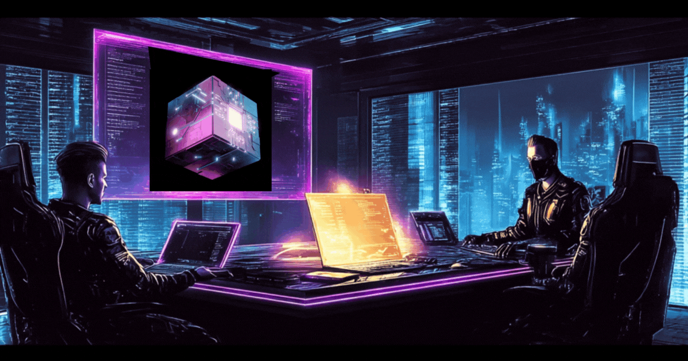

  

  <i>Systems • Mathematics • Depth • Legacy</i>

  Web Developer | Python & Django Developer

---

###   About Me

-   I’m learning **Python & Django**
-   I build **Websites and Web Apps**
-   Always learning new technologies
-   Goal:  Become a **Professional Software Engineer**

---

###   Tech Stack

---

<!-- Animated Typing -->

  

<!-- Animated Wave -->

  

<!-- Activity Graph -->

  

<!-- Matrix Style -->

  

  

  

  

  <b><i>Like waves, growth rises and falls — but never stops.</i></b>

  

<!-- Animated Snake -->

  

  

